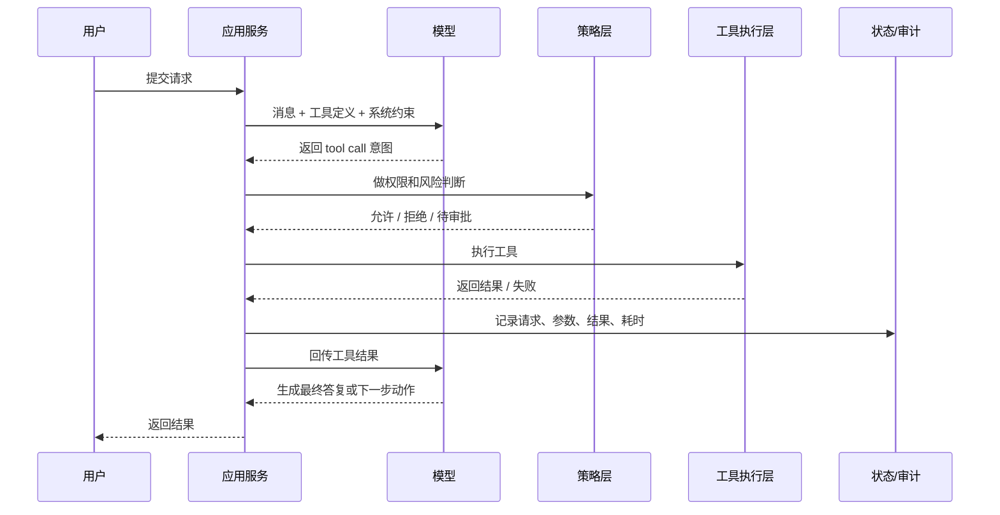
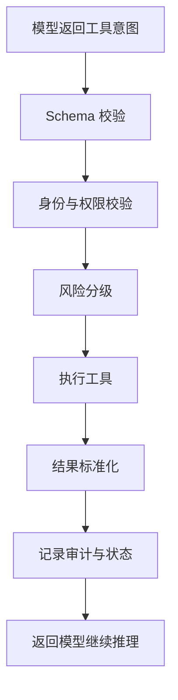

# 智能体开发实战：Tool Use / Function Calling 为什么难，难在哪里

> 大模型会调用工具，这件事一开始很容易让人兴奋。
>
> 因为它看起来像是一个历史性的转折点：模型不再只是“回答问题”，而开始“接触世界”。它可以查数据库、发工单、调用内部 API，甚至在很多产品演示里，看起来已经像一个能干活的数字员工。
>
> 但真正做过一轮系统落地的人，很快就会意识到，Function Calling 最麻烦的部分从来不是“把工具定义传给模型”，而是之后那一整串工程问题：
>
> 它什么时候该调工具，什么时候不该调？  
> 它调错了怎么办？  
> 同一个动作失败重试会不会变成重复执行？  
> 写操作到底能开放到什么程度？  
> 当模型选错工具、拼错参数、或者工具返回了一堆半结构化垃圾时，系统谁来兜底？

我越来越觉得，Tool Use / Function Calling 真正标志的不是“模型更强了”，而是**你的系统终于要开始为模型的外部行为负责**。

::: info 这篇文章重点
- Function Calling 的真实闭环到底长什么样
- 为什么“让模型直接写 SQL”几乎总是一个坏主意
- 工具描述、执行网关、幂等和审计日志为什么才是工程重心
- 为什么多数团队第一版智能体，真正应该开放的其实只是只读工具
:::

## 1. 先把神秘感拆掉：模型没有在执行代码，它只是提出了一个“执行意图”

这件事说透了其实非常朴素。

所谓 Function Calling，本质上是下面这四步：

1. 你先把“有哪些工具可用、参数长什么样”告诉模型；
2. 模型在当前上下文里判断要不要用工具、该用哪个工具；
3. 它返回一个结构化的调用意图；
4. 你的系统根据这份意图，自己去真正执行工具，然后再把结果回给模型。

也就是说，真正的执行者始终不是模型，而是你的应用。

这句话听上去像常识，但很多危险设计恰恰就是忘了这一点。

一旦团队在认知上把模型当成“真的会去做事的主体”，后面的系统边界就会开始模糊：

- 它会被默认允许做太多决定；
- 工具执行失败会被误当成“模型理解失败”；
- 审计、幂等和权限都容易被放到后面补。

而只要你始终记得“模型只是提出意图，系统才是真正执行者”，很多工程判断就会立刻变清晰。

## 2. 一个真正可落地的 Tool Use 闭环，远比 API 示例复杂

API 文档里的示例通常都很干净：

- 用户问一个问题；
- 模型选中一个工具；
- 应用执行；
- 再把结果送回模型；
- 最后模型给出答案。

这条链路当然是对的，但生产系统里，真实闭环一般更像下面这样：



你会发现，这里面真正值得花时间的部分，不是“把 `tools` 参数写对”，而是中间多出来的那些层：

- 策略层；
- 工具执行层；
- 状态与审计层；
- 失败处理层。

如果这些层没有建立起来，Tool Use 大概率只能停留在 Demo。

## 3. 为什么很多“看起来聪明”的方案，一上生产就很危险

最典型的一种，就是让模型直接生成 SQL，然后拿这段 SQL 去执行。

这么做的诱惑非常大，因为它看起来像一条最短路径：

- 你不用单独封装很多业务工具；
- 模型仿佛拥有了“万能查询能力”；
- 对演示来说很炫。

但从工程角度看，这几乎把所有风险都叠满了：

### 3.1 权限边界模糊

当你给模型的是数据库，而不是一个明确的业务工具时，它在逻辑上拥有的能力几乎是开放式的。即便你写了提示词说“只能查，不能改”，这仍然只是文本约束，不是系统约束。

### 3.2 查询语义不可控

模型可能误解字段、表关联或者过滤条件，结果看起来“像那么回事”，但实际上已经错了。更麻烦的是，这种错常常不容易被立刻发现。

### 3.3 提示注入风险被直接放大

只要上游输入有机会污染到这条链路，模型就可能被诱导生成危险语句。就算你挡掉了最明显的 `DROP TABLE`，也挡不住更隐蔽的越权查询和语义滥用。

所以我现在几乎会把一条原则写得很死：

> 不要把数据库、shell、消息总线这类“底层通用能力”直接暴露给模型。  
> 模型应该调用的是**有边界的业务工具**，而不是拥有无限解释空间的底层接口。

## 4. 工具设计最容易犯的错，不是写错 Schema，而是“想做万能入口”

第一次设计工具时，很多人会本能地追求“少而全”。于是就会出现这类接口：

```json
{
  "name": "operate_system",
  "parameters": {
    "type": "object",
    "properties": {
      "action": { "type": "string" },
      "payload": { "type": "object" }
    }
  }
}
```

从程序员角度看，这种设计很优雅；从模型调用角度看，它恰恰太空了。

模型真正需要的，不是抽象能力，而是可判断的边界。

### 4.1 为什么“窄工具”通常比“万能工具”更稳

来看两个版本：

版本 A：

- `operate_system(action, payload)`

版本 B：

- `get_employee_vacation(employee_name)`
- `create_jira_ticket(summary, priority, assignee)`
- `search_contract_by_id(contract_id)`

版本 B 的好处很朴素，但非常关键：

- 模型更容易选；
- 参数更容易校验；
- 权限更容易控制；
- 审计更容易看懂；
- 失败更容易定位。

换句话说，窄工具的本质不是“更啰嗦”，而是把不确定性前置拆掉了。

### 4.2 工具命名其实也在“训练模型”

工具名不是写给人看的文档标题，它本身就是模型识别能力的一部分。

例如：

- `query_db` 这个名字告诉模型的是“你有一个很大的自由空间”；
- `get_employee_vacation` 告诉模型的是“这是一个精确能力，输入是员工名，输出是剩余年假”。

越接近业务动作本身的命名，模型就越容易少犯“选对方向却参数乱填”的错误。

## 5. Schema 不是附属品，而是你和模型之间的契约层

很多团队在工具定义里会把描述写得很认真，但对参数结构反而写得很松。其实真正决定系统稳定性的，经常是 Schema，而不是描述文字。

至少有四件事必须明确：

- 参数类型；
- 必填项；
- 枚举范围；
- 对异常输入的处理规则。

如果这些都不清晰，模型就很容易“猜一个差不多的参数”。而系统一旦开始靠“差不多”执行外部动作，风险就会迅速上升。

### 5.1 一个很现实的经验：能枚举就不要开放文本

比如工单优先级，如果系统只接受：

- `low`
- `medium`
- `high`

那就不要让模型自由发挥成：

- `urgent`
- `highest`
- `一般偏高`

对模型来说，自由文本更自然；对系统来说，自由文本意味着更多失败分支。Schema 的意义，就是把“语言世界”压缩成“软件世界能接受的有限状态”。

## 6. 真正的工程重心在执行网关，而不是模型那一层

很多人会把 Tool Use 想成“模型升级”，但真正决定系统能不能上线的，通常是执行网关。

执行网关至少要做六件事：

1. 参数校验；
2. 权限判断；
3. 风险分级；
4. 工具执行；
5. 结果标准化；
6. 全链路审计。



### 6.1 为什么一定要有风险分级

因为从系统视角看，不是所有工具调用都属于同一个世界。

大体可以分成三档：

| 风险级别 | 典型动作 | 建议策略 |
| --- | --- | --- |
| 低风险 | 查日志、查知识库、查库存 | 可以自动执行 |
| 中风险 | 创建工单、发内部通知、生成草稿 | 可以执行，但要有审计和配额 |
| 高风险 | 改权限、改账单、删记录、转资金 | 默认不自动执行，必须审批 |

真正成熟的系统，通常不是“功能越多越强”，而是知道哪些动作永远不该交给模型直接完成。

### 6.2 多数企业第一版，其实只该开放只读工具

这句话听起来保守，但我认为非常务实。

因为第一版你最缺的通常不是“执行力”，而是对整个闭环的信心：

- 模型会不会稳定选对工具；
- 参数会不会经常偏；
- 工具返回结果能不能被模型正确理解；
- 用户会不会误解系统能力边界。

如果这些还没跑顺，就上写操作，等于在不稳定系统外面再套一层更危险的副作用。

## 7. 并发调用很迷人，但它不是“越多越先进”

多工具并发是另一个很容易被过度浪漫化的点。

确实，有些场景非常适合并发：

- 同时查询多个城市天气；
- 同时检查多个服务状态；
- 同时对多份独立文档做摘要。

但只要进入下面这些情况，并发就要开始变得谨慎：

- 下一步依赖上一步结果；
- 调用顺序会影响业务结果；
- 涉及有副作用的写操作；
- 下游系统本身有速率限制或事务要求。

### 7.1 并发带来的真正难题，不在模型，而在系统

并发看起来只是“多发几个请求”，但它会立刻引出三个系统问题：

#### 谁来聚合结果

如果三个工具两个成功一个超时，接下来怎么办？直接把半成品丢回模型，往往不是最稳的做法。更可靠的是由编排层先做一次聚合和状态归一。

#### 谁来处理超时和局部失败

你必须提前决定：

- 一个失败是否导致整体失败；
- 是否允许部分成功；
- 是否自动重试；
- 是否触发降级回答。

这些都不该临时交给模型“自由发挥”。

#### 谁来保证不重复执行

这是写操作里最容易被低估的问题。请求超时后，系统以为失败，于是重试；但下游其实已经执行成功了。于是你得到的不是一个“失败请求”，而是两个成功的危险动作。

所以只要涉及副作用，幂等性就不是优化项，而是基本设施。

## 8. 幂等、状态恢复和审计日志，决定了你能不能睡得着

Demo 和生产之间，往往就差在这些“不性感的部分”。

### 8.1 幂等键：防止“重试 = 重复执行”

每一次有副作用的工具调用，都应该拥有：

- 唯一请求 ID；
- 下游可识别的幂等键；
- 可查询的执行状态。

这样即便出现超时、服务重试或进程重启，也能判断“这一步到底有没有做过”。

### 8.2 状态恢复：不要让任务全靠上下文窗口活着

如果一个 Agent 任务需要多轮工具调用，你就不能只依赖 `messages` 去保存状态。更稳妥的方式是把关键过程持久化下来，例如：

- 当前步骤；
- 已执行工具；
- 工具结果摘要；
- 待审批项；
- 失败原因。

这样即使服务中断，系统也能从某个明确状态继续，而不是重新让模型“回忆”刚才发生了什么。

### 8.3 审计日志：这不是合规装饰，而是排错工具

一条可用的审计日志，至少应该回答：

- 用户当时说了什么；
- 模型选了哪个工具；
- 参数是什么；
- 是否通过了策略检查；
- 工具结果是什么；
- 最终系统回复是什么。

没有这条链路，你在出问题时只能看到“好像模型调错了”。有了这条链路，你才能真正判断：

- 是模型选错工具；
- 还是 Schema 太松；
- 还是权限规则没挡住；
- 还是工具返回值本身就不干净。

## 9. 工具结果返回给模型时，也别再偷懒

很多系统在这一层会犯一个很常见的错：直接把工具原始返回值塞回模型。

如果返回值是：

- HTML；
- 长日志；
- 半结构化 JSON；
- 异常堆栈；
- 某种内部协议格式；

那模型下一轮就很容易被脏数据带偏。

更好的做法是做一层结果标准化，例如：

```json
{
  "success": true,
  "data": {
    "employee_name": "张三",
    "vacation_days": 12
  },
  "error": null
}
```

这一步表面看只是“整理一下”，实际上很重要，因为它在把工具世界重新翻译回模型能稳定理解的世界。

## 10. 一个现实的落地建议：别一上来做“万能智能体”，先做“可控工具协作”

如果我今天重新带一个团队做第一版 Tool Use，我会很克制。

我不会先追求：

- 多工具并发编排；
- 自动写操作；
- 巨型通用工具集；
- 全自动闭环执行。

我会先追求下面这些更朴素的目标：

1. 先开放 3 到 5 个边界清晰的只读工具；
2. 所有工具都必须有明确 Schema；
3. 所有调用都经过统一执行网关；
4. 所有结果都标准化回流；
5. 所有请求都带审计日志；
6. 所有高风险写操作默认改成“生成建议 + 人工确认”。

这样做看起来慢，但它会让你的系统从第一天开始就是可控的，而不是等出事后再补边界。

## 11. 小结：Function Calling 的真正难点，不在“调模型”，而在“替模型负责”

如果只看演示，Function Calling 像是在给模型装手脚。

但从工程视角看，它更像是在给系统加责任：

- 你要负责它能调什么；
- 你要负责它不能调什么；
- 你要负责它调错了怎么收场；
- 你要负责这个过程可恢复、可审计、可解释。

所以 Function Calling 真正的门槛，不是会不会把工具定义写成 JSON Schema，而是你有没有把工具调用当成一条完整的软件系统链路来设计。

一旦你这样看它，很多决策就会变得很自然：

- 工具要窄，不要泛；
- 写操作要慎，不要贪；
- 幂等和审计要先做，不要后补；
- 模型只负责“提意图”，系统负责“做执行”。

这也是我现在理解的 Agent 开发分水岭：不是模型开始会调工具的那一刻，而是团队终于开始认真替它的外部行为负责的那一刻。

## 参考资料

- [OpenAI Function Calling Guide](https://platform.openai.com/docs/guides/function-calling)
- [OpenAI Structured Outputs Guide](https://platform.openai.com/docs/guides/structured-outputs)
- [Anthropic Tool Use Overview](https://platform.claude.com/docs/en/docs/agents-and-tools/tool-use/overview)
- [Anthropic Implement Tool Use](https://platform.claude.com/docs/en/docs/agents-and-tools/tool-use/implement-tool-use)
- 延伸阅读：[企业级全栈 AI 助手系统设计](./chatbot-project)
