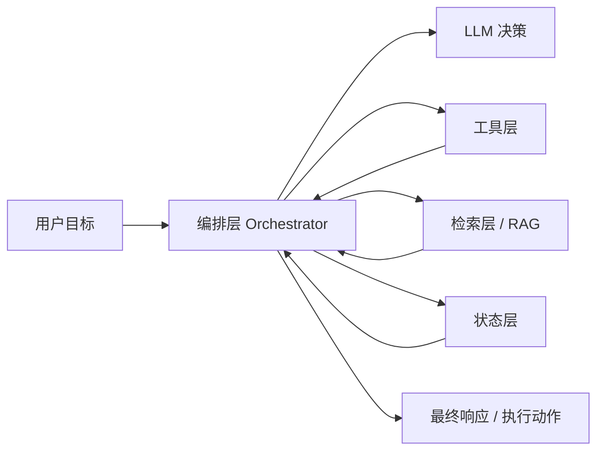
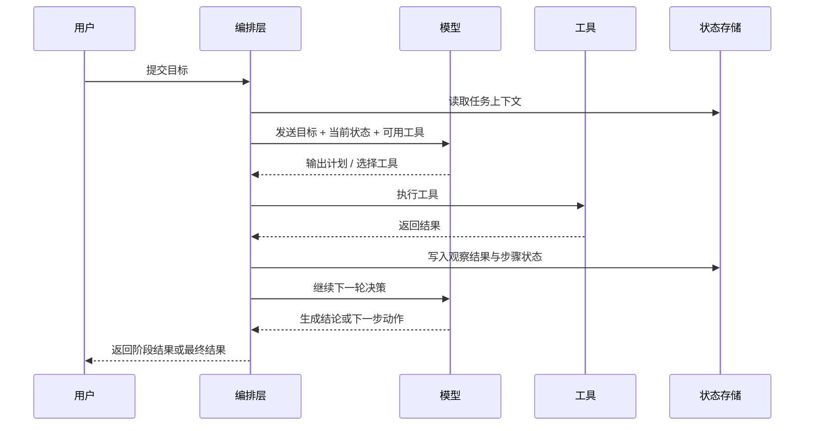

# 从聊天到执行：AI Agent 的最小工程架构

> 很多团队第一次聊 Agent，都会不自觉滑向两个极端：要么把它想成“聊天机器人 Pro Max”，要么把它想成“终于可以替我上班的数字员工”。
> 真正动手做之后，兴奋会很快被现实拉回来。模型没有状态、不会自己执行、也不天然可信。它之所以看起来像个能干活的代理，靠的不是一句神奇提示词，而是一整套被系统严密看管的执行闭环。

::: info 这篇文章解决什么问题
- Agent 和普通聊天应用的本质差别是什么
- 一个可落地的 Agent 至少由哪些组件组成
- 什么时候该用单 Agent，什么时候该拆成多 Agent
- 为什么很多“智能体项目”最后会死在状态、边界和观测上
:::

## 1. Agent 到底比 Chat 多了什么

普通聊天应用的核心流程很简单：

1. 收到用户输入
2. 拼装上下文
3. 调一次模型
4. 返回答案

而 Agent 至少多了三层能力：

- **目标驱动**：不是只回答一句，而是围绕目标持续推进
- **环境交互**：可以读取外部信息、调用工具、写入系统
- **状态延续**：能记住局部进展，并据此调整后续动作

这意味着 Agent 不是一个新的模型类别，而是一个**以大模型为决策核心、由外部系统补足状态与执行能力的应用架构**。



如果把聊天助手理解为“模型 + UI”，那么 Agent 更接近：

`Agent = LLM + 状态 + 工具 + 编排 + 反馈循环`

## 2. 一个可落地 Agent 的四个核心部件

### 2.1 Profile：角色边界

Profile 不是“写一个酷炫人设”这么简单，它在工程上承担三件事：

- 定义职责范围：这个 Agent 负责什么，不负责什么
- 设定风格与约束：输出要偏解释、偏执行，还是偏审计
- 给后续路由提供依据：不同角色可以映射不同工具和权限

好的 Profile 看起来像岗位说明书，而不是小说人物设定。例如：

```text
你是企业内部的研发效能助手。
你的职责是帮助开发者分析代码问题、总结风险、生成改进建议。
你不能直接执行写库、删库、转账、发正式通知等高风险动作。
如需调用工具，优先选择只读工具；涉及写操作必须返回待审批计划。
```

### 2.2 Memory：状态不是模型自带的

很多演示里，Agent 像是“真的记住了一切”。实际上，状态几乎总是你在系统外部维护的。

常见做法可以分成三层：

| 层次 | 存什么 | 生命周期 | 常见实现 |
| --- | --- | --- | --- |
| 短时记忆 | 当前会话上下文、最近几轮观察结果 | 单次对话 | `messages`、会话缓存 |
| 工作记忆 | 当前任务计划、子任务进度、工具结果摘要 | 单个任务周期 | 状态机、任务表、KV 存储 |
| 长时记忆 | 用户偏好、历史案例、组织知识 | 长期 | 向量库、知识库、业务库 |

误区在于：把所有东西都直接塞进上下文窗口。这样做很快会遇到三类问题：

- 成本高：上下文越长，请求越贵
- 噪声大：模型会被无关历史稀释注意力
- 不稳定：历史越长，越容易出现“明明提过，却没用上”

更稳妥的方式是把状态分层保存，只把当前决策真正需要的内容装回上下文。

### 2.3 Tools：Agent 能干活，靠的是工具而不是“想象力”

Agent 之所以能“查数据库、发工单、触发工作流”，不是模型自己会联网或执行系统调用，而是你把可用能力通过工具暴露给它。

工具层至少要解决四件事：

- 描述接口：工具名、用途、参数结构、约束
- 绑定权限：这个 Agent 能调用哪些工具
- 控制副作用：是否允许写操作，是否需要审批
- 记录结果：工具输出要变成后续推理的输入

在工程上，工具最好分成三类：

| 类型 | 示例 | 风险 |
| --- | --- | --- |
| 只读工具 | 查库存、查订单、查日志、查文档 | 低 |
| 外部动作工具 | 发消息、创建工单、触发工作流 | 中 |
| 写入型工具 | 改状态、改配置、写数据库 | 高 |

团队第一次做 Agent 时，最值得坚持的一条原则是：**先把只读工具做好，再考虑写入工具**。

### 2.4 Planning：计划不等于“想得很多”

Agent 的 Planning 不一定意味着复杂的树搜索。对多数业务场景来说，它更像“把复杂任务拆成可验证的短步骤”。

一个够用的计划系统，通常需要：

- 把任务拆成有限步骤
- 每步之后检查是否成功
- 失败时决定重试、降级或人工接管

这本质上是“模型负责出主意，系统负责把过程变成确定的状态迁移”。

## 3. 单 Agent 的最小闭环

大多数可落地的 Agent，第一版并不需要多 Agent。先把单 Agent 的基本闭环做对，更重要。



这个闭环里，真正重要的不是“模型一步想得多聪明”，而是下面三件事：

1. 每轮决策都能拿到足够但不过载的上下文
2. 每次工具调用都有明确结果和失败状态
3. 任务过程可以恢复、审计、回放

## 4. 多 Agent 什么时候有意义

多 Agent 很容易看起来高级，但也非常容易“复杂得没有收益”。判断是否真的需要拆分，可以看下面三个条件：

### 4.1 职责是否天然分离

如果一个系统同时包含“需求澄清、资料检索、代码修改、质量审查”几种认知模式，拆角色是有价值的。因为不同角色可以拥有不同提示词、工具权限和评价标准。

### 4.2 是否需要并行

如果任务可以天然拆成互不依赖的子任务，例如同时查询多个系统、并行分析多个文档、多个候选方案并发评审，多 Agent 才可能带来真实收益。

### 4.3 是否需要明确审查链路

在高风险场景里，常见拓扑是：

- Planner：拆任务
- Worker：执行子任务
- Reviewer：检查结果

这类结构的意义不在于“更像组织架构”，而在于能把质量控制显式化。

## 5. 真正的难点：不是会不会调模型，而是能不能管住系统

Agent 项目最容易失败的地方，通常不在“模型不够强”，而在下面这些工程问题：

### 5.1 状态失控

常见表现：

- 任务做到一半，服务重启后无法恢复
- 工具已经执行成功，但系统以为失败，于是重复执行
- 不同轮次的中间结果相互污染

解决方式：

- 给任务和步骤引入唯一 ID
- 明确步骤状态：待执行、成功、失败、已补偿
- 对有副作用的工具设计幂等键

### 5.2 权限过大

如果同一个 Agent 同时拥有查数据、改数据、发通知的全套权限，风险会迅速放大。更稳妥的方式是把工具权限做成白名单，并将高风险工具放到审批链后面。

### 5.3 缺乏观测

没有观测的 Agent，出了问题很难定位。建议至少记录：

- 用户目标
- 每轮输入与模型输出摘要
- 工具调用记录
- 最终结果与失败原因
- Token 成本、延迟、重试次数

### 5.4 目标定义过大

一句“帮我自动处理所有客户投诉”听起来很酷，但在工程上过大。更可落地的做法是先收缩成：

- 帮我归类投诉
- 帮我总结关键信息
- 帮我建议处理方案
- 最终动作仍由人工确认

## 6. 一个更实用的判断框架

如果你要决定“某个需求到底该不该做成 Agent”，可以先问五个问题：

1. 这个任务是否包含多步决策，而不是一次问答？
2. 任务执行过程中，是否需要读取外部状态？
3. 是否需要调用一个或多个工具？
4. 是否存在明确的成功/失败判断标准？
5. 出错时能否安全回退或人工接管？

如果前 3 个答案都是否，往往普通聊天应用就够了；如果前 4 个都为是，第 5 个也可控，再考虑 Agent。

## 7. 小结

Agent 不是“更会聊天的模型”，而是一个把模型放进执行闭环里的系统工程问题。它真正的价值来自：

- 用模型做动态决策
- 用工具连接真实世界
- 用状态和编排让过程可恢复、可审计、可控制

在这个视角下，Agent 的关键不在“多智能”，而在“边界清楚、过程稳定、结果可验证”。

## 参考资料

- [Anthropic: Tool use overview](https://docs.anthropic.com/en/docs/agents-and-tools/tool-use/overview)
- [OpenAI: Function calling](https://platform.openai.com/docs/guides/function-calling)
- [OpenAI: Structured outputs](https://platform.openai.com/docs/guides/structured-outputs)
- [ReAct: Synergizing Reasoning and Acting in Language Models](https://arxiv.org/abs/2210.03629)
- 延伸阅读：[智能体开发实战 (Function Calling)](./agent-development)
