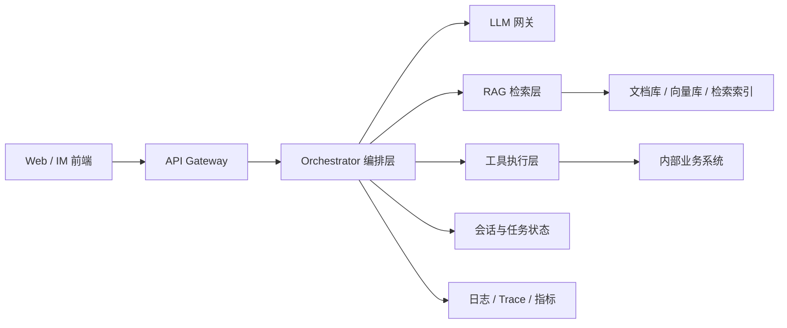
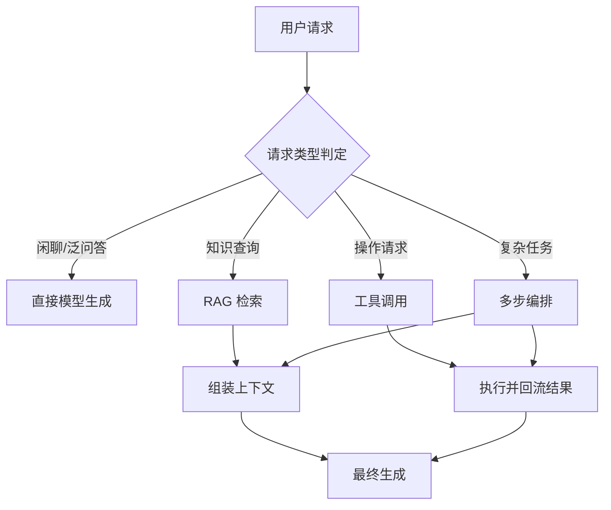

# 企业级全栈 AI 助手系统设计：从聊天界面到可观测服务

> “做一个公司内部 AI 助手”这句话，最迷惑人的地方在于它听起来太轻了，像是下周就能顺手做完的小需求。
> 但只要真的有人开始用，事情会立刻变重：流式体验、会话状态、RAG、工具调用、权限、安全、审计、观测会一下子全部扑上来。很多 Demo 不是做不出来，而是做出来之后才发现自己其实只完成了最容易的那 20%。

::: info 这篇文章覆盖什么
- 一个企业级 AI 助手的核心需求分解
- 前端流式体验、后端编排、RAG/Tool 路由如何协同
- 会话状态、权限审计、观测与降级策略如何设计
- 从 Demo 到生产的演进路径应该怎么走
:::

## 1. 先定义系统边界，而不是先选模型

企业内部助手最常见的需求通常混在一起：

- 问答：查询制度、合同、流程、技术文档
- 检索：从知识库或业务系统找到事实
- 操作：创建工单、发通知、调用内部接口
- 协作：把结果以摘要、报告、待办形式回传给用户

如果一开始就把它当成“一个聊天框 + 一个模型”，后面会遇到三个问题：

1. 无法区分“需要回答”还是“需要执行”
2. 无法明确哪些数据能看、哪些动作能做
3. 无法定位是模型问题、检索问题还是系统问题

因此更推荐先按职责把系统拆开。

## 2. 推荐的整体架构

这套拆分的好处是：

- 前端只关心交互与流式展示
- 编排层负责判断这次请求该走哪条路线
- RAG 层和工具层可以独立演进
- 观测与权限不依赖模型自身能力

## 3. 前端体验：为什么流式响应是刚需

用户对 AI 产品的第一印象，往往不是“答案多专业”，而是“系统是不是卡住了”。对长回答场景来说，流式响应几乎是必选项。

### 3.1 建议的前端交互

- 首字尽快出现，降低等待焦虑
- 工具执行过程有阶段反馈，如“正在检索制度文档”“正在查询工单系统”
- 支持中断生成与重新提问
- 工具型回答和问答型回答使用不同 UI 展示

### 3.2 前端不是只渲染文本

当系统走了 RAG 或工具调用路径，前端可以适度暴露过程信息：

- 引用了哪些资料
- 是否执行了哪个工具
- 当前结果是草稿、最终结论还是待审批动作

这会明显提升用户信任感，也有助于排查问题。

## 4. 后端编排层：真正的大脑不在模型，而在路由

同一句用户输入，可能走完全不同的处理路径：

- 纯聊天：直接问模型
- 知识问答：走 RAG
- 操作请求：走 Tool Use
- 混合请求：先检索，再调工具，最后生成答案

这意味着后端需要一个显式编排层，而不是简单把所有输入都转发给模型。

### 4.1 路由判定要回答的不是“像不像 Agent”

更实用的判定标准是：

- 这个问题的答案是否依赖企业私有知识
- 这个问题是否需要访问实时数据
- 这个问题是否要产生外部副作用

只要涉及后两者，就不应该直接把它当成普通聊天。

## 5. 会话状态：短对话和长任务不能用同一套模型

企业助手至少要管理两种状态：

| 类型 | 例子 | 建议存储 |
| --- | --- | --- |
| 聊天状态 | 最近几轮对话、当前语言风格 | Redis / 会话缓存 |
| 任务状态 | 当前步骤、工具结果、审批状态 | 任务表 / 工作流引擎 |

如果把所有状态都塞进 `messages`：

- 成本会持续上涨
- 长任务无法恢复
- 出错后几乎没法排查

更推荐的做法是：

- 会话层只保留与表达相关的上下文
- 任务层单独记录流程状态和关键中间结果

## 6. RAG 与 Tool 的分工

很多项目最大的问题，是把 RAG 和 Tool Use 混成一团。其实两者职责很不同：

### 6.1 RAG 负责“补事实”

适合场景：

- 查制度
- 查合同条款
- 查知识文档
- 给出基于资料的解释

### 6.2 Tool 负责“取实时数据 / 做动作”

适合场景：

- 查当前余额
- 查最新工单状态
- 创建任务
- 更新业务记录

一个实用的系统原则是：

- **静态知识优先走 RAG**
- **实时状态优先走工具**
- **涉及副作用一定走工具**

## 7. 权限、安全与审计：生产环境的硬要求

企业助手一旦接入业务系统，安全问题会立刻从“内容风险”变成“操作风险”。

至少要有三层防线：

### 7.1 数据权限

- 当前用户能看到哪些知识
- 当前用户能查询哪些业务数据
- 当前 Agent 被允许调用哪些工具

### 7.2 动作权限

- 哪些动作可以自动执行
- 哪些动作需要审批
- 哪些动作禁止开放给模型

### 7.3 审计追踪

每次请求至少记录：

- 用户输入摘要
- 路由结果
- 引用文档或工具调用记录
- 最终回答
- Token 成本与延迟

没有审计的 AI 助手，很难进入真正的企业环境。

## 8. 观测设计：你需要知道系统到底慢在哪里

AI 应用的延迟通常来自多个阶段：

- 首次排队
- 检索耗时
- 模型首字时间
- 工具调用耗时
- 最终生成耗时

建议至少建立以下指标：

| 指标 | 作用 |
| --- | --- |
| TTFT（首字时间） | 观察用户体感延迟 |
| 检索耗时 | 判断知识库瓶颈 |
| 工具成功率 | 判断外部系统稳定性 |
| 每请求 Token 成本 | 判断成本结构 |
| 引用命中率 | 判断 RAG 质量 |

同时用 Trace 记录一条请求完整经过了哪些环节，后期排查问题会非常关键。

## 9. 从 Demo 到生产，建议分三步走

### 第一步：只做问答闭环

- 聊天前端
- 基础会话状态
- 模型网关
- 少量知识文档

目标是确认用户问题类型和真实需求。

### 第二步：引入 RAG 和观测

- 知识切分与索引
- 引用展示
- 检索评估
- 成本与延迟指标

目标是确认“回答质量是否稳定”。

### 第三步：引入工具与审批流

- 只读工具
- 有副作用工具的审批机制
- 幂等与状态恢复
- 全链路审计

目标是让助手从“会回答”变成“能协助完成任务”。

## 10. 一个常见但错误的做法

很多团队会把“企业助手”设计成一个超大 Prompt：

- 让它自己判断要不要查知识库
- 让它自己拼接 SQL
- 让它自己组织动作
- 让它自己决定要不要执行

这种方案的问题不是“不够优雅”，而是工程边界完全模糊。一旦出错，你无法回答：

- 错在知识召回还是模型推理
- 为什么执行了这个动作
- 有没有越权
- 能不能回滚

真正能落地的系统，一定是把这些责任显式拆开。

## 11. 小结

企业级 AI 助手不是“一个会聊天的页面”，而是一套围绕模型组织起来的系统工程：

- 前端负责体验与可解释反馈
- 编排层负责路径判断与状态推进
- RAG 负责提供静态事实
- Tool 负责访问实时世界
- 安全、审计、观测负责把能力关进边界里

当这些层次明确之后，模型才会真正成为系统能力的一部分，而不是一团难以控制的黑盒。

## 参考资料

- [OpenAI: Function calling](https://platform.openai.com/docs/guides/function-calling)
- [OpenAI: Structured outputs](https://platform.openai.com/docs/guides/structured-outputs)
- [Anthropic: Tool use overview](https://docs.anthropic.com/en/docs/agents-and-tools/tool-use/overview)
- [Retrieval-Augmented Generation for Knowledge-Intensive NLP Tasks](https://arxiv.org/abs/2005.11401)
- 延伸阅读：[初探 RAG 架构](./rag-intro)
