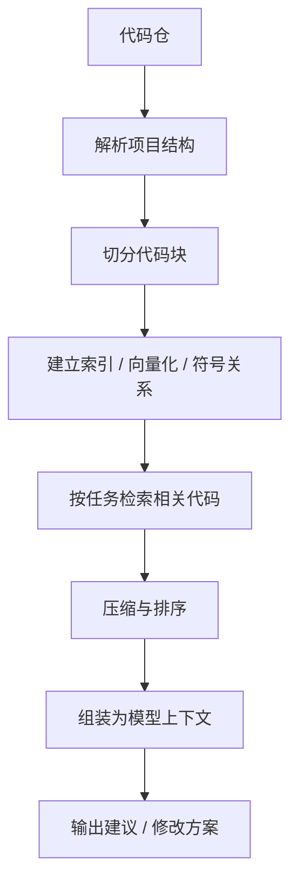

# 代码库上下文工程：让 AI 真正理解你的项目

> 代码场景里，最让人挫败的一幕不是模型不会写，而是它明明写得很像样，放进项目里却怎么看都别扭。
> 它可能语法没错、命名也像回事，但就是和你的工程上下文对不上：它不知道这段代码在整个系统里扮演什么角色，不知道哪个类其实只是过渡层，也不知道你们团队到底把什么当成“合理做法”。
> 所以在代码场景中，真正决定输出质量的往往不是那一句 Prompt 本身，而是你到底喂给了模型多少“项目里的现实”。

::: info 这篇文章重点
- 为什么代码场景下的 Prompt 问题，本质上是上下文工程问题
- 什么叫“局部上下文、仓库上下文、任务上下文、反馈上下文”
- IDE、索引、检索、压缩和摘要各自解决什么问题
- 如何在成本、延迟与质量之间取得平衡
:::

## 1. 最常见的问题：模型知道语法，不知道项目

模型通常具备不错的语言和代码生成能力，但它天然不知道：

- 你的模块边界
- 业务命名约定
- 哪些类是基础设施，哪些类是核心领域
- 你的构建系统、测试策略和回滚方式

这解释了为什么很多“单文件改动建议”看起来语法没错，但放到项目里就是不成立：

- 改动漏掉了接口实现
- 只改调用方，没改契约
- 生成了团队根本不用的模式
- 修了表面报错，却破坏了隐藏分支

换句话说，代码场景里真正稀缺的不是模型的“语言能力”，而是**高质量上下文**。

## 2. 上下文不是一段长 Prompt，而是一个分层系统

可以把代码场景下的上下文分成四层：

| 层次 | 内容 | 作用 |
| --- | --- | --- |
| 局部上下文 | 当前文件、附近代码、选中片段 | 解决眼前改动 |
| 仓库上下文 | 相关接口、调用链、相邻模块、项目约定 | 解决“改动会不会影响别处” |
| 任务上下文 | 当前目标、验收标准、限制条件 | 解决“到底要改成什么样” |
| 反馈上下文 | 测试结果、构建报错、审查意见 | 解决“刚才那次改动为什么失败” |

只有第一层时，模型更像“高级补全”。
同时拥有前三层时，才开始具备“辅助完成一个真实任务”的能力。

## 3. 局部上下文够用的场景，其实比你想象中少

局部上下文适合下面这些问题：

- 补一段函数实现
- 修一处显眼的语法错误
- 写一个小测试用例
- 为已有函数补注释

一旦任务变成下面这些，就很容易超出局部上下文能力：

- 重构跨模块接口
- 找出某个异常的根因
- 修改一个影响多个实现的公共契约
- 按照团队已有模式新增功能

这时继续“只喂当前文件”，往往会让模型把看似合理的局部改动放到错误的系统位置上。

## 4. 仓库上下文如何被组织起来

现代 AI 编程工具的能力差异，核心之一就在这里。一个更稳妥的上下文工程方案，通常会包含下面几步：



### 4.1 结构解析

第一步不是“把整个仓库扔给模型”，而是先理解项目结构：

- 模块和包组织
- 构建文件
- 依赖关系
- 入口与配置

这一步决定了后面的检索是否有方向感。

### 4.2 代码切分

代码切分不能只按固定长度，否则会破坏语义边界。更合理的粒度通常是：

- 类
- 方法
- 配置块
- 测试用例

当代码块能对应明确语义单元时，后续检索质量会明显更高。

### 4.3 检索与排序

检索不是“多拿一点就更好”。在代码场景中，最重要的是相关性排序：

- 当前符号定义
- 关键调用链
- 相关测试
- 构建或报错位置
- 团队范例实现

如果把太多“略微相关”的代码一起塞进上下文，模型反而更容易失焦。

## 5. 任务上下文：最容易被忽略的一层

即便仓库上下文足够完整，如果任务描述很模糊，结果仍然会漂。

不好的任务描述：

```text
把这段代码重构得更优雅一些。
```

更好的任务描述应该包含：

- 目标：要解决什么问题
- 限制：不能改什么
- 交付物：希望输出什么
- 验收：以什么为准判定成功

例如：

```text
请把这个 300 行方法拆成多个私有方法，但不要改变现有对外接口和返回结构。
优先减少分支嵌套，不引入新的设计模式。
输出时先给出重构计划，再给关键改动点，最后说明哪些测试需要补。
```

在工程场景里，这样的约束比“写得更厉害一点”有用得多。

## 6. 反馈上下文：真正让模型进入闭环

很多团队会在第一次回答不理想后，重新开一个新会话继续问。这样做会损失最重要的上下文之一：**失败反馈**。

反馈上下文通常来自：

- 编译错误
- 测试失败
- Lint 结果
- Code Review 意见
- 运行日志

把这些反馈结构化地回喂给模型，效果通常比“重新描述一遍问题”更直接。

推荐做法是：

1. 先让模型给方案或改动
2. 在本地执行构建或测试
3. 把失败结果和关键代码片段回喂
4. 要求它只针对失败点修正

这比一开始追求“一次到位”更符合真实工程环境。

## 7. 上下文压缩：不是塞满，而是保留决策需要的部分

上下文工程的核心不是尽可能多，而是尽可能有用。

常见压缩策略包括：

- 保留接口定义，压缩实现细节
- 保留调用链关键节点，删除重复代码
- 保留错误堆栈和直接相关文件，删除外围噪声
- 把长日志先总结，再把摘要送入模型

一个实用原则是：**优先保留会影响决策的事实，压缩可推导的细节**。

## 8. 一个可执行的工作流

如果你要让 AI 帮忙完成一次真实改动，可以按下面这个流程组织上下文：

| 步骤 | 要给模型什么 |
| --- | --- |
| 任务澄清 | 目标、限制、验收标准 |
| 结构摸底 | 模块说明、相关文件、关键调用链 |
| 方案讨论 | 当前实现问题、备选方案、约束 |
| 实施改动 | 相关代码块、需要保持兼容的接口 |
| 验证修复 | 构建报错、测试结果、审查意见 |

这套流程比单次长 Prompt 更重要，因为它把“上下文”变成了一种可持续组织的信息流。

## 9. 常见反模式

### 9.1 把整个仓库直接塞进上下文

结果通常是成本飙升、噪声变大、质量并未同步提升。

### 9.2 只给报错，不给目标

模型可能能修这个报错，但不知道你的真实意图，容易修出局部正确、整体错误的结果。

### 9.3 只给目标，不给约束

这会导致模型自作主张引入新的模式、改动更多文件、甚至改变行为。

### 9.4 不保留失败反馈

没有测试和构建反馈，模型很难进入有效迭代。

## 10. 小结

代码场景下，Prompt 的上限取决于上下文工程。真正有效的做法不是“想一句更厉害的话”，而是把任务信息、仓库信息和反馈信息分层组织起来，让模型在正确的上下文里工作。

当团队开始这样使用 AI 时，它就不再只是写几行代码的补全工具，而会逐步变成一个能参与真实开发流程的协作者。

## 参考资料

- [Cursor: Codebase indexing](https://docs.cursor.com/context/codebase-indexing)
- [GitHub Copilot 文档](https://docs.github.com/en/copilot)
- [JetBrains AI Assistant 文档](https://www.jetbrains.com/help/ai-assistant/about-ai-assistant.html)
- [OpenAI: Prompt engineering](https://platform.openai.com/docs/guides/prompt-engineering)
- 延伸阅读：[日常开发提效方案实战](./daily-efficiency)
