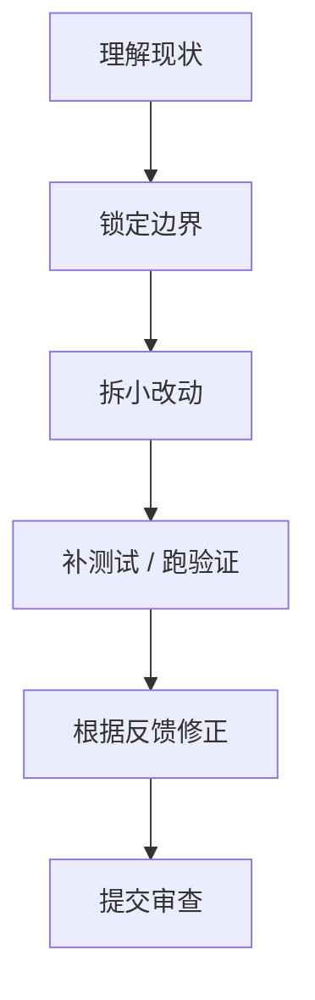
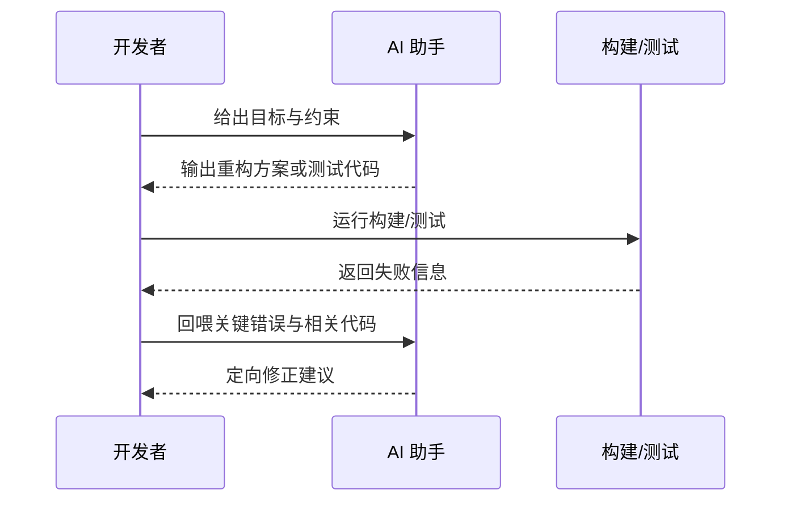

# AI 辅助重构与测试补齐：一套更稳的日常提效方法

> AI 在开发里最容易让人上头的一幕，是它一口气吐出几百行“像模像样”的修改建议。
> 也是在这一刻，最需要冷静。因为真实项目里，速度从来不是唯一目标。大家真正需要的，不是一个敢猛改的搭子，而是一个能在不放大风险的前提下，帮你更快理解旧代码、重构结构、补测试和收敛失败反馈的协作者。

::: info 这篇文章重点
- 如何把 AI 用在理解旧代码、拆分重构、补测试这三类高价值工作上
- 为什么“一把梭重构”通常比手写更危险
- 如何把构建、测试和 Review 反馈变成 AI 的修正回路
- 一套适合日常开发的稳妥工作流
:::

## 1. 为什么重构场景特别适合 AI

重构难，不只是因为代码难写，而是因为它同时包含三种成本：

- **理解成本**：先搞清楚现有逻辑到底在做什么
- **变更成本**：把结构改好但不改坏行为
- **验证成本**：确认没有引入回归

AI 在这里最有价值的地方，不一定是直接改代码，而是帮你更快完成前两步的“信息整理”和“候选方案生成”。

尤其在下面这些场景里很有效：

- 大方法拆分
- 条件分支梳理
- 调用链说明
- 补测试样例
- 根据失败日志做定向修正

## 2. 最危险的用法：一句“帮我重构得更优雅”

这类提示最大的问题，是把所有关键决策都留给了模型：

- 到底改结构还是改行为
- 允许改多少文件
- 能不能引入新模式
- 要不要改公共接口

结果往往是：

- 代码“看起来更漂亮”，但行为漂了
- 引入过度设计
- 改动面超出你的审查能力

更稳的做法不是让 AI “自由发挥”，而是把重构拆成多个受控阶段。

## 3. 一套更稳的 AI 重构流程



### 3.1 先让 AI 做“解释器”，不是“改写器”

第一步建议只让模型解释现有逻辑：

- 列出主流程
- 列出关键分支
- 标注外部依赖
- 指出复杂度高的位置

这个阶段不要让它直接输出新代码。因为你还没确认它是否真正理解了现有行为。

### 3.2 再锁边界

在动代码前，需要明确告诉模型：

- 哪些外部接口不能变
- 哪些行为必须保持
- 本轮只允许改哪些文件
- 优先优化什么，不优化什么

例如：

```text
请只重构方法内部结构，不修改 public 方法签名，不调整返回体字段，不新增框架依赖。
目标是减少嵌套分支，提高可读性。
```

### 3.3 只做小步改动

对 AI 来说，“一次改完整个模块”通常比“完成一个小步改动”风险高很多。

更推荐的粒度是：

- 先抽取一个私有方法
- 再拆一个条件分支
- 再统一一个重复校验
- 最后补测试

这样每一步都可以单独审查和验证。

## 4. 补测试：AI 的高收益区

很多团队在老系统里最大的阻力不是“不会改”，而是“没有保护网不敢改”。这正是 AI 很适合介入的区域。

### 4.1 先补什么测试

推荐顺序：

1. 主流程 Happy Path
2. 明显分支和异常路径
3. 已知线上问题对应路径
4. 边界条件和历史 bug 回归测试

不建议一开始就要求模型“把覆盖率做到很高”。先保护最重要路径，更符合实际收益。

### 4.2 给模型什么输入最有效

补测试时，下面这些信息非常有帮助：

- 被测方法或类
- 关键依赖
- 期望行为
- 一两个典型输入输出
- 当前已有测试风格

如果连团队常用测试框架、断言风格、Mock 方式都不告诉模型，它很容易生成“不符合项目习惯”的测试代码。

## 5. 构建和测试反馈，才是 AI 真正的闭环

AI 在开发流程里真正高效的地方，是“根据失败结果快速修正”。这比它第一次输出多完美更重要。



### 5.1 什么反馈值得回喂

- 编译错误
- 单测失败断言
- Lint 报错
- Code Review 指出的问题

### 5.2 什么反馈不值得整段丢进去

- 大量重复日志
- 与当前改动无关的历史失败
- 长篇构建输出里与当前类无关的噪声

回喂时应尽量保留关键信息、压缩外围噪声。

## 6. 一个实用的任务模板

如果你要把 AI 用在重构与补测试，可以按下面的节奏：

| 阶段 | 目标 | AI 适合做什么 |
| --- | --- | --- |
| 摸底 | 理解现有实现 | 生成流程说明、分支梳理、依赖分析 |
| 设计 | 明确重构方式 | 比较方案、列出风险、给拆分计划 |
| 实施 | 小步提交改动 | 输出局部修改建议、补辅助方法 |
| 验证 | 建立保护网 | 补 Happy Path、补异常测试 |
| 修正 | 消除回归 | 根据构建/测试失败做定向修复 |

这套流程的重点不是“让 AI 代替开发者”，而是把开发者最费时间的信息整理工作交给 AI，把判断和确认保留给人。

## 7. 什么时候不该交给 AI

有些任务不适合第一时间交给 AI：

- 你自己都还没理解业务目标
- 这次改动涉及核心算法正确性
- 缺乏足够的验收标准
- 一次改动会跨多个敏感模块

这类场景里，先由人把边界画清楚，再让 AI 参与局部环节，通常更稳。

## 8. 常见反模式

### 8.1 一次性大改

表面上省时间，实际上会让 Review 和回滚都变得困难。

### 8.2 只让 AI 改代码，不让 AI 先解释

这样你无法判断它是否真正理解原逻辑。

### 8.3 把覆盖率当成唯一目标

覆盖率高不等于保护网有效。关键路径和高风险路径更重要。

### 8.4 不把失败信息回喂

没有反馈闭环，AI 就只能重复猜测。

## 9. 一份可复用的检查清单

在用 AI 做重构前，最好确认下面这些问题：

- 当前改动的行为边界是否明确
- 是否知道哪些接口不能动
- 是否有最基本的验证方式
- 是否准备好了先做小步改动
- 是否能把失败结果快速回喂给 AI

如果这些都具备，AI 在重构和补测试中的收益通常会非常明显。

## 10. 小结

AI 在日常开发提效里最稳的价值，并不是“替你写完整功能”，而是：

- 更快理解旧代码
- 更快拆分改动
- 更快建立保护网
- 更快消化失败反馈

当你把它放进一个小步、可验证、有反馈的流程里，AI 才更像一个可靠的工程协作者，而不是不受控的代码生成器。

## 参考资料

- [GitHub Copilot 文档](https://docs.github.com/en/copilot)
- [Cursor: Codebase indexing](https://docs.cursor.com/context/codebase-indexing)
- [JetBrains AI Assistant 文档](https://www.jetbrains.com/help/ai-assistant/about-ai-assistant.html)
- 延伸阅读：[代码库上下文工程](./context-prompting)
