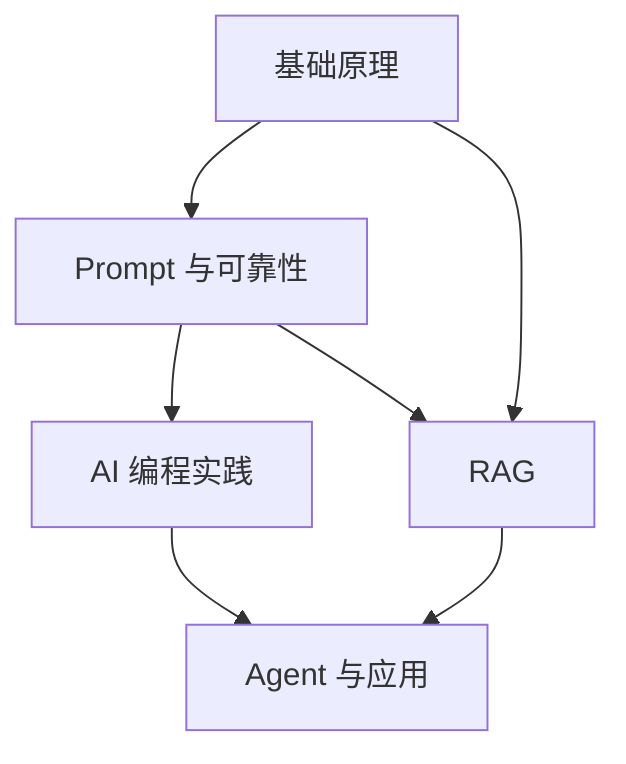

# AI 专栏导读：从模型原理到工程落地

> 如果你点进这个专题，是希望看到一套“讲完概念就散场”的 AI 科普，那这里大概不会走那条路。
> 我更想把它写成一组真的能陪工程师往下走的文章：不只讲机制，也讲代价；不只讲做法，也讲什么时候别做；不只追求信息量，还要尽量让你读完能带走一点判断力。

::: info 适合谁读
- 有开发经验，想系统补齐大模型、RAG、Agent 与 AI 编程实践的人
- 已经在用 AI，但仍觉得“会聊天，不会落地”的工程师或技术负责人
- 需要为团队做 AI 选型、架构判断或知识普及的负责人
:::

## 这套专栏怎么读

如果你是第一次系统学习，建议按下面的顺序阅读：

1. 先读“基础原理”，建立算力、模型、Token 与 Transformer 的最小认知闭环。
2. 再读“Prompt 与可靠性”，理解为什么模型会失控、如何约束输出、如何降低幻觉。
3. 接着读“AI 编程实践”，把模型带回真实代码库，看工具选型、重构、上下文工程如何影响效率。
4. 然后进入 “RAG”，理解知识库系统为什么经常“能召回、答不对”，以及正确的工程链路长什么样。
5. 最后读 “Agent 与应用”，把模型、工具、检索和系统工程拼起来，看一个完整 AI 应用如何设计。

## 知识地图

## 阅读路线

| 模块 | 你会解决什么问题 | 代表文章 |
| --- | --- | --- |
| 基础原理 | 为什么大模型这么吃算力？为什么会有上下文限制？ | `hardware-and-compute`、`what-is-model`、`llm-mechanisms` |
| Prompt 与可靠性 | 为什么同样一句话，不同写法差这么多？怎么让输出更稳？ | `prompt-basics`、`advanced-prompting`、`hallucination` |
| AI 编程实践 | AI 编程工具差别到底在哪里？怎么让模型真正理解代码库？ | `tools-comparison`、`daily-efficiency`、`context-prompting` |
| RAG | 为什么知识库看起来搭起来了，回答还是不靠谱？ | `rag-intro`、`vector-database`、`rag-deep-dive` |
| Agent 与应用 | 如何把模型变成一个可调用工具、可接系统、可观测的应用能力？ | `llm-apis`、`agent-development`、`chatbot-project` |

## 这次重构后的写法

为了让内容更适合工程师阅读，后续文章会统一遵循下面的结构：

- 先给出真实问题，而不是直接灌术语
- 解释机制时，补充适用条件、代价与边界
- 实践类文章优先讲架构判断、关键流程和反模式
- 每篇至少保留一个可复用的方法、一个图表或流程图、一组参考资料
- 时效敏感内容会明确标注资料基线日期，避免“旧知识伪装成常识”

## 推荐入口

- 想先补理论：从 [从人工智能到生成式 AI](./ai-evolution) 开始
- 想先做 Prompt：从 [Prompt 核心框架](./prompt-basics) 开始
- 想先提升开发效率：从 [主流 AI 编程工具选型指南](./tools-comparison) 开始
- 想先搭知识库：从 [初探 RAG 架构](./rag-intro) 开始
- 想直接看应用设计：从 [智能体开发实战](./agent-development) 开始

## 说明

本文是专栏导读页。后续各篇会按统一风格持续重写与补充，优先保证内容专业、清晰、可复用，而不是追求“每段都很燃”。
