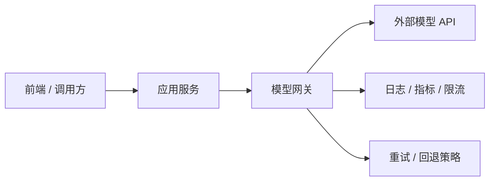

# 主流大模型 API 接入指南：Responses、聊天接口与流式输出

> 第一次把模型接进系统时，大家通常都会先盯着请求体怎么写，生怕少传一个字段。
> 可真正让人掉坑的，往往不是那几个字段本身，而是之后一整套看起来没那么“AI”、却决定系统能不能稳定上线的东西：状态怎么管、流式怎么做、结构化输出怎么接、失败怎么重试、成本怎么控。

::: warning 时效性说明
本文以 `2026-03-17` 可公开查阅的官方资料为基线。不同厂商接口演进较快，具体字段与能力请以官方文档为准。
:::

## 1. 为什么很多厂商都在兼容 OpenAI 风格

今天的模型接入生态里，一个明显现象是：许多厂商会提供兼容 OpenAI 风格的接口。

原因很现实：

- 开发者生态已经形成
- 大量 SDK、框架和示例围绕这一接口形态构建
- 应用系统更希望更换模型时少改业务代码

这也是为什么理解“通用接口模式”比背某一家字段更重要。

## 2. 当前常见的两类接口形态

### 2.1 Responses 风格接口

以 OpenAI 当前官方文档为例，`/v1/responses` 被定位为更通用的响应接口，支持：

- 文本输入输出
- 多轮状态延续
- 结构化输出
- 工具调用
- 内建工具扩展

这类接口更适合“一个统一入口管理多种响应能力”的方向。

### 2.2 Chat Completions 风格接口

很多模型平台和兼容层仍广泛提供 `chat/completions` 风格接口。它在生态里依然非常常见，尤其是：

- 历史项目
- 框架兼容层
- OpenAI-compatible 服务

所以工程上经常要同时理解这两种形态。

## 3. 接入时真正要关心什么

### 3.1 消息组织

无论是哪种接口，最关键的问题都是：

- system 放什么
- user 放什么
- 历史消息保留多少
- 什么时候引入结构化上下文

模型没有天然记忆，所以状态组织是应用自己的责任。

### 3.2 流式输出

对聊天、问答、长文本生成场景来说，流式输出几乎是标配。它的价值主要在于：

- 降低用户等待焦虑
- 更快首字响应
- 让前端可以展示阶段性结果

### 3.3 结构化输出

如果输出要被程序继续消费，就应该优先考虑：

- JSON Schema
- 严格字段约束
- 解析失败重试

这会显著提高工程稳定性。

## 4. 接入层常见的系统设计

建议把模型调用封装进统一网关层，而不是散落在各个业务模块里。这样更容易：

- 控制密钥
- 统一重试和超时
- 统计成本
- 记录审计和日志

## 5. 常见坑

### 5.1 不控制历史消息长度

聊天轮数一多，Token 成本和失败概率都会上升。

### 5.2 只要文本，不做结构化约束

这会让后续解析和自动化处理变得脆弱。

### 5.3 没有重试与超时策略

模型调用是外部依赖，必须像其他远程服务一样治理。

### 5.4 不区分“回答失败”和“系统失败”

模型返回质量问题，和网络超时、限流、服务异常是两类不同问题，应该分开处理。

## 小结

大模型 API 接入的关键，并不是学会某个请求体，而是理解一套稳定的接入模式：

- 用统一网关管理调用
- 用流式输出优化体验
- 用结构化输出提高可消费性
- 用重试、限流、日志和成本统计把外部依赖纳入治理

## 参考资料

- [OpenAI Responses API Reference](https://platform.openai.com/docs/api-reference/responses)
- [OpenAI: Structured outputs](https://platform.openai.com/docs/guides/structured-outputs)
- [Anthropic API 文档](https://docs.anthropic.com/)
- 延伸阅读：[初探 RAG 架构](./rag-intro)
