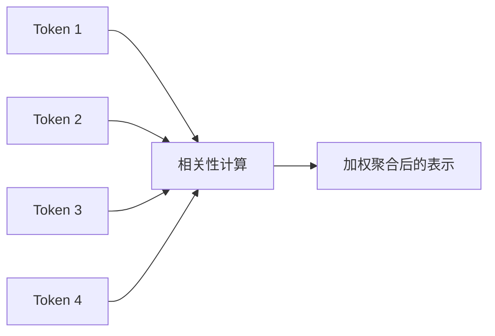

# Transformer 与文字接龙机制：为什么 Self-Attention 能统一大模型时代

> Transformer 这几个字，这几年几乎被讲到有点麻木了。大家都知道它重要，也大概知道有个 Self-Attention，但真要问“它到底凭什么把前面的主流方案都慢慢挤到边上去”，很多解释又会突然变得过于数学或者过于抽象。
> 对工程师来说，更有感觉的问法其实是：它到底解决了什么老问题，为什么一解决，后面的大模型时代就顺着它长出来了。

::: info 这篇文章重点
- 为什么 RNN/LSTM 在大规模语言建模中逐渐失势
- Self-Attention 的核心计算直觉是什么
- Transformer 为什么适合扩展到今天的大模型
- 这些机制如何影响实际工程表现
:::

## 1. 先看旧方案为什么不够

在 Transformer 普及之前，处理序列数据常见的是 RNN、LSTM 这类递归结构。它们的问题不是完全不能用，而是在大规模语言建模上会越来越吃力：

- 序列计算强依赖前一步，难以并行
- 长距离依赖难处理
- 随着序列拉长，训练效率和稳定性都受影响

语言模型要面对的恰恰是超长序列、大规模数据和巨量参数，所以这类限制会被迅速放大。

## 2. Self-Attention 的直觉：每个 Token 都去看谁最相关

Self-Attention 可以粗略理解为：

- 序列中的每个 Token，不只看前一个 Token
- 它会根据当前任务，动态决定该“关注”序列中的哪些位置

例如一句话里，“它”到底指代谁，往往需要看前面更远的位置。Self-Attention 的价值就在于：这种关系不需要通过层层递归慢慢传过去，而可以直接建立相关性。

## 3. Q、K、V 可以怎么理解

经典解释是 Query、Key、Value。工程上可以把它们理解成：

- **Query**：我现在想找什么信息
- **Key**：我这里有什么特征，值不值得你关注
- **Value**：如果你关注我，你最终拿走什么内容

当一个 Token 的 Query 和另一个 Token 的 Key 很匹配，就说明两者相关性高，于是对应的 Value 会在结果里占更大权重。

这种机制让模型可以按任务动态建图，而不是依赖固定窗口或固定规则。

## 4. 为什么 Transformer 更适合大规模训练

### 4.1 并行性更强

RNN 类结构往往需要按时间步一步步算，而 Transformer 可以更好地并行处理整段输入。这对大规模训练非常关键。

### 4.2 长距离依赖更容易建模

理论上，序列中任意两个位置都可以直接建立注意力关系，不必经过很长的路径传递。

### 4.3 架构更容易扩展

Transformer 组件化程度高，适合与更大数据、更大模型、更强算力结合，这也是它能成为大模型统一底座的重要原因。

## 5. 文字接龙机制为什么有效

从应用层看，大语言模型最直观的工作方式像“文字接龙”：根据前文预测下一个 Token。

这听起来简单，却能做出复杂能力，关键原因有两个：

1. 训练数据规模巨大，模型见过海量模式
2. Self-Attention 让模型能在长上下文中动态组织相关信息

于是一个看似简单的“下一个词预测”，在足够大的数据和参数规模下，会表现出：

- 归纳模式
- 跟随格式
- 多步展开
- 跨领域迁移

## 6. 这对工程实践意味着什么

理解 Transformer，不只是为了懂论文，还会直接影响工程判断：

### 6.1 上下文很重要

因为模型的行为强依赖输入上下文，提示词、检索结果和历史对话的组织方式会明显影响输出。

### 6.2 长上下文不是没有代价

Attention 机制强大，但上下文变长时，计算和注意力分配也会变复杂。上下文越长，不代表有效信息一定越多。

### 6.3 模型不是数据库

Transformer 擅长模式建模，不擅长精确存储不断变化的事实。这也是 RAG 和工具调用如此重要的原因。

## 7. 常见误区

### 7.1 以为“注意力”就是模型真的理解了

注意力是计算机制，不等于人类意义上的理解。

### 7.2 以为上下文越长越好

长上下文会提升可容纳信息量，但不保证模型一定能稳定利用所有信息。

### 7.3 以为 Transformer 只适合文本

事实上，Transformer 已经扩展到图像、语音、多模态等多个领域。它的统一性本身就是它成功的重要原因之一。

## 8. 小结

Transformer 之所以成为大模型时代的基础架构，不是因为概念更炫，而是因为它同时满足了几个关键条件：

- 更适合并行训练
- 更容易处理长距离关系
- 更容易扩展到超大模型规模

理解了这一点，再去看 Prompt、RAG、Agent 等上层应用时，就更容易明白：为什么上下文组织、检索质量和结构化约束会对输出结果产生这么大影响。

## 参考资料

- [Attention Is All You Need](https://arxiv.org/abs/1706.03762)
- [The Illustrated Transformer](https://jalammar.github.io/illustrated-transformer/)
- 延伸阅读：[什么是 Token 与上下文窗口？](./what-is-token)
