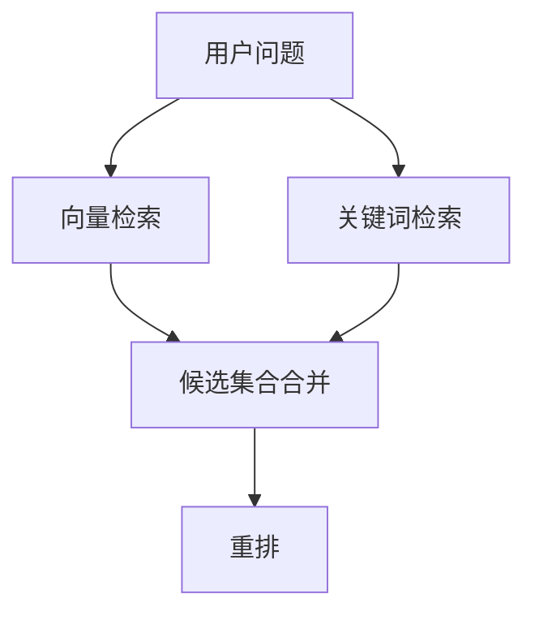

# 深入剖析 RAG：Chunking、Hybrid Retrieval、Rerank 与上下文组装

> 很多团队第一次把 RAG 跑通时，都会先开心五分钟，然后开始怀疑人生：明明都检索到了，怎么还是答不对？
> 这类挫败感特别真实，因为系统表面上没报错，召回分数看起来也不低，页面上甚至还能展示引用来源。可真正的问题往往藏在更前面：文档是怎么切的、候选是怎么召回的、噪声是怎么混进去的、最后又是怎么被一股脑塞进上下文的。

::: info 这篇文章重点
- 为什么 Naive RAG 经常出现“能召回、答不对”
- 文档切块、混合检索、重排和上下文组装各解决什么问题
- 怎样用更工程化的方式评估 RAG 系统
- 一套更适合企业知识场景的链路设计
:::

## 1. RAG 失败，通常不是失败在“生成”，而是失败在“供料”

RAG 的本质是把生成建立在外部事实之上。但从用户问题到最终答案，中间至少有四道关：

1. 文档被怎么切块
2. 候选结果怎么召回
3. 候选结果怎么排序
4. 最终上下文怎么组装

任何一环做得粗糙，最终答案都会受影响。

## 2. Chunking：切块方式决定了能否拿回完整语义

最常见但也最粗糙的做法，是按固定长度切块，比如每 500 个字切一段。这在工程上简单，但代价也明显：

- 句子可能被硬切断
- 标题和正文被拆开
- 表格或条款上下文丢失
- 召回命中了片段，但片段本身无法支撑回答

### 2.1 常见切块策略对比

| 策略 | 优点 | 问题 | 适用场景 |
| --- | --- | --- | --- |
| 固定长度切块 | 实现简单 | 语义经常断裂 | 原型验证 |
| 重叠切块 | 缓解边界断裂 | 冗余增加 | 通用文本 |
| 结构化切块 | 保留标题、段落、表格关系 | 实现更复杂 | Markdown、HTML、制度文档 |
| 语义切块 | 更贴近自然语义单元 | 依赖切分质量 | 长文、解释型材料 |
| Parent-Child 切块 | 检索精度和上下文完整度兼顾 | 需要双层索引 | 企业知识库 |

### 2.2 为什么 Parent-Child 很实用

一种在企业场景里很常见的做法是：

- 写入时把文档切成较小子块，便于精确召回
- 同时保留较大父块，便于回答时补足背景

检索时命中的是子块，最终送给模型的可以是子块所在的父块或父块摘要。这样能兼顾：

- 检索精度
- 上下文完整性
- Token 成本控制

## 3. Retrieval：向量检索不是全部答案

向量检索擅长找“语义相近”的内容，但它不一定擅长找：

- 精确编号
- 稀有术语
- 合同条款编号
- 人名、设备号、SKU 这类专有标识

这也是为什么很多生产系统会采用混合检索。

### 3.1 Hybrid Retrieval 的基本思路

常见做法是同时走两路：

- **Dense Retrieval**：向量检索，找语义相关
- **Sparse Retrieval**：关键词检索，例如 BM25，找字面命中

这样做的优势很直接：

- 语义召回负责“意思相近”
- 关键词召回负责“字面必须命中”

尤其在企业资料里，很多关键事实恰恰藏在编号、术语和固定表达中，单靠向量检索并不稳。

## 4. Rerank：把“粗相关”变成“高相关”

初次召回拿回来的候选集，通常只是“可能有用”。如果直接把这些内容全部丢给大模型，很容易出现两类问题：

- 噪声太多，真正有用信息被淹没
- 候选太长，模型注意力分散

因此 Rerank 的作用，是在更小的候选集上做更精细的相关性排序。

### 4.1 为什么需要单独的重排层

因为检索和重排追求的不是同一件事：

- 检索追求高召回，宁愿多拿一点
- 重排追求高精度，要把最有用的结果排到前面

在工程上，这通常意味着：

1. 先用相对便宜的检索方法拿回 Top N
2. 再用更精细的模型或规则，把 Top N 排序
3. 最终只保留少量高价值片段送给生成模型

### 4.2 Rerank 解决的是“排序问题”，不是“真理问题”

要注意，重排不能修复所有问题。如果切块本身已经断裂、召回就没命中关键内容，Rerank 也只能在错误候选里挑“相对更像正确的”。

## 5. Context Assembly：最后一步经常被低估

即使你拿到了不错的候选结果，如何把这些结果送进模型也很关键。

常见错误包括：

- 原样拼接所有候选
- 不保留来源信息
- 不区分主证据和补充证据
- 把长片段全文塞入，导致上下文污染

### 5.1 更好的上下文组装原则

- 优先放最相关证据
- 保留来源标识，便于前端展示引用
- 把重复内容合并
- 对特别长的候选先做压缩或摘要
- 静态背景和直接证据分层组织

一个更实用的组装模板可能是：

1. 问题重写后的检索意图
2. Top 1 到 Top 3 直接证据
3. 必要的补充背景
4. 输出要求，例如“若证据不足请明确说明”

## 6. 如何评估一条 RAG 链路

RAG 项目很容易只看最终回答好不好，但这样很难定位问题。更稳妥的方式是分层评估。

| 层次 | 要看什么 |
| --- | --- |
| 切块层 | 是否保留了语义边界 |
| 召回层 | 关键证据是否进入候选集 |
| 重排层 | 关键证据是否排在前面 |
| 组装层 | 送给模型的上下文是否简洁且充分 |
| 生成层 | 是否忠实引用证据，是否承认证据不足 |

如果只看最终答案，就会把所有问题都误判成“模型不够强”。

## 7. 企业场景里的推荐链路

对大多数企业知识问答项目，一个更稳妥的中间形态通常是：

1. 文档解析与清洗
2. 结构化切块或 Parent-Child 切块
3. 向量检索 + BM25 混合召回
4. 对候选集做去重与重排
5. 组装精简上下文
6. 生成答案并展示引用
7. 用日志和人工抽检反哺切块与检索策略

这条链路未必最“前沿”，但通常比单纯“文档切块 + 向量库 + 大模型”稳得多。

## 8. 常见反模式

### 8.1 把向量库当成全部答案

向量库解决的是召回，不是完整的 RAG 质量问题。

### 8.2 只看检索分数

高分不等于能支撑回答。分数只是召回算法的内部信号。

### 8.3 候选拿太多

候选过多会把噪声也一并放大，未必比少量高质量候选更好。

### 8.4 没有来源展示

没有引用来源，用户很难建立信任，开发者也很难排查问题。

## 9. 小结

RAG 做得好不好，关键不在“有没有向量库”，而在整条信息供应链是否合理：

- 切块是否保住语义
- 召回是否兼顾语义和关键词
- 重排是否把真正关键证据提到前面
- 上下文组装是否克制而有结构

当你把这些环节都拆开看，RAG 的问题就不再神秘，而会变成一组可以逐步优化的工程问题。

## 参考资料

- [Retrieval-Augmented Generation for Knowledge-Intensive NLP Tasks](https://arxiv.org/abs/2005.11401)
- [Lost in the Middle: How Language Models Use Long Contexts](https://arxiv.org/abs/2307.03172)
- [OpenAI Cookbook](https://cookbook.openai.com/)
- 延伸阅读：[初探 RAG 架构](./rag-intro)
