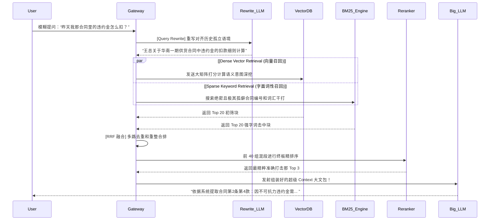

# 降维打击与知识外挂：RAG (检索增强生成) 架构的生产级演进

> 当企业想让大模型“懂自己的业务”（比如读懂公司内部长达十万字的 HR 规章，或者刚拉下来的今年 Q3 财务报表）时。无论是业务高层还是初入 AI 圈的开发者，第一反应往往是：“我们把这些数据拿去**微调 (Fine-Tuning)** 一个我们的专属大模型吧！”
>
> 作为架构师，你必须在这个关键路口果断且极其专业地拦住他们。微调在绝大多数企业级“知识注入”场景下是一场**灾难级投资**。

本章，我们将不讲概念，直接从投资回报率 (ROI) 与架构生命周期出发，推导为什么 **RAG (Retrieval-Augmented Generation, 检索增强生成)** 才是当前工业界引入私有数据的唯一绝对主导核心王牌架构。

---

## 1. 为什么微调 (SFT) 是一场知识注入的骗局？

**微调 (Supervised Fine-Tuning, SFT)** 的本质是让模型学习**“语气、格式和极其底层的技能范式”**，而不是生硬地学习**“知识库记忆”**。

如果你强行用微调去让大模型背诵“公司 2023 年报第三季度的利润是 1.5 亿”：
1. **幻觉的温床**：模型的神经元网络是浮点数概率矩阵，不是关系型数据库。它无法 100% 精确存储这个具体的数字，它极大概率在生成时吐出“1.4亿”或“1.6 亿”（这就是灾难级幻觉反噬）。
2. **极长且高昂的更新周期**：明天财务数据更新了。你无法单独通过 `UPDATE SQL` 删掉旧权重。你必须把新数据和历史大山再融合一次，花几千美元启动几十张 A100 再跑好几天才能完成极其微小的数据更新。
3. **权限隔离的崩盘**：你的知识库里有的是给高管看的绝密薪资，有的是给新人的入职手册。微调后的模型脑子里塞满了所有数据，它一旦被攻破越狱，任何普通员工一句套话咒语就能把它肚子里高管的薪资全部榨取出来。

---

## 2. 投资回报的终极答案：RAG 架构范式

RAG 的理念就是“不要让大脑本身去背书，而是给大脑接上一个能随时翻阅文件的图书馆档案馆”。模型负责其原本极擅长的**“逻辑推理”**，外部企业自己的数据库负责**“事实供给”**。

### 标准的 Naive RAG (RAG 1.0) 核心流转：

1. **企业数据结构化入库 (Ingestion)**：
   将乱七八糟的企业 Word/PDF/日志进行清洗，切削成固定字数大小的代码块，利用深度学习模型将其实时转化为抽象的数学**高维向量 (Embeddings)** 并长久压进特殊的底盘——**向量数据库 (Vector DB)**。
2. **实时提问劫持与向量比对 (Retrieval)**：
   当用户提问：“Q3的利润是多少？”。网关不会直接发给大语言模型。而是直接将这句话当面进行一样的算向高维向量。
   紧接着利用这段由于刚被翻译成向量数组由于拿着这极长的特征和数据库里存下极大由于几百万片片段特征做降维大矩阵撞击。并在极微几毫秒间召回极前 5 个因为带有浓重财务特征的关联度极其紧密最高段文字落。
3. **大模型装载并被动做答 (Generation)**：
   将用户极其简单的原问，和我们刚翻箱倒柜由于精准找到拿起的极其珍贵前 5 段资料片一并丢发入大极大拼接极其大的长文中强压塞丢发入超模型的上下文窗里。

---

## 3. 从 1.0 走向深渊阵地：RAG 3.0 (Modular RAG 高阶架构图解)

但在极具真实的工业界实战推演投产落地中，普通的 RAG 1.0 经常会遇到“答非所问”。现代企业级架构师开始搭建极高演变出的 **Modular RAG 重兵压境模块体系**：

在这个被全副装甲覆盖武装在网关外甲的 RAG 大防体系下，系统能不能跑动走起极其决下核心决胜且大极权战场的权杖落点大位变成了——掌握百万千万级切片池算分引擎：**深入拆解向量数据库的黑盒与 HNSW 本质**。
