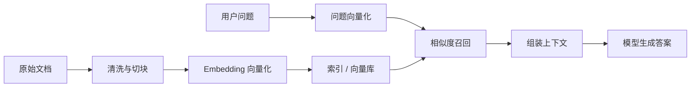

# 初探 RAG 架构：为什么企业知识问答通常先做检索增强

> 只要一提“让模型懂公司知识”，微调几乎总会第一个跳出来。它听起来像个很顺手的答案：既然模型不懂，那就把知识喂进去嘛。
> 但真实业务里，事情通常没这么直给。多数企业知识不是一句“学会了”就算完，它们会更新、会分权限、会有出处要求，还经常和具体的业务上下文绑在一起。也正因为这样，RAG 才会成为更常见的起点。

::: info 这篇文章重点
- 为什么企业知识场景通常优先考虑 RAG
- 微调和 RAG 分别解决什么问题
- 一个基础 RAG 系统包含哪些核心环节
- 什么场景适合 RAG，什么场景不适合
:::

## 1. 先回答一个核心问题：你想补的是“知识”还是“能力”

微调和 RAG 经常被拿来对比，但它们解决的问题并不完全一样。

### 1.1 微调更像在调整能力或风格

微调更适合：

- 固定输出格式
- 专项任务风格
- 行业语气和表达
- 特定任务习惯

### 1.2 RAG 更像在补充事实来源

RAG 更适合：

- 企业制度
- 合同文档
- 产品说明
- FAQ
- 经常更新的知识材料

如果你真正缺的是“最新事实”，RAG 往往比微调更自然。

## 2. 为什么企业知识更适合放在外部知识层

企业知识通常具有几个特点：

- 更新频繁
- 权限复杂
- 来源分散
- 需要保留出处

这些特征和参数化存储并不天然匹配。因为一旦事实变化，你并不能像更新数据库那样精确改掉模型里的旧知识。

而 RAG 的思路是：

- 让模型继续负责理解和表达
- 让外部系统负责提供事实

这样更接近现代软件系统的职责分工。

## 3. 一个基础 RAG 系统长什么样

你可以把它理解成三段：

1. **入库**：文档被清洗、切块、建立索引
2. **召回**：问题到来时，从候选知识中找相关片段
3. **生成**：把片段作为事实依据，辅助模型作答

## 4. RAG 的价值不只是“知道答案”，还有可控性

在工程实践中，RAG 的价值不仅体现在回答质量，还体现在系统治理上：

- 可以按权限控制不同知识源
- 可以展示引用出处
- 可以单独更新文档，不必重训模型
- 可以分层定位问题：是检索错了，还是生成错了

这些特性对企业场景尤其重要。

## 5. 什么时候不要把 RAG 当万能解法

RAG 也有边界，不是所有问题都适合。

### 5.1 不适合的场景

- 需要严格实时写操作
- 需要复杂事务执行
- 任务重点不在知识，而在操作或规划
- 问题主要依赖数据库中的结构化实时数据

这时更合适的可能是：

- 工具调用
- 工作流系统
- 数据库查询层

### 5.2 RAG 不等于“检索完就一定答对”

即使引入 RAG，也仍然可能失败：

- 文档切块不合理
- 召回不到关键证据
- 候选结果噪声太大
- 上下文组装不佳

这也是为什么 RAG 后续会继续演化出混合检索、重排和上下文压缩等能力。

## 6. 一个更实用的判断标准

如果你在做企业知识问答，可以先问：

1. 知识是否主要来自文档或说明材料？
2. 知识是否更新频繁？
3. 是否需要保留引用来源？
4. 是否存在细粒度权限控制？

如果答案大多为是，那么 RAG 往往是更自然的起点。

## 7. 小结

RAG 的意义，不只是“让模型查资料”，而是把知识管理从模型参数里拆出来，交给一个更适合存储、检索和治理事实的外部系统。

它并不能解决所有 AI 问题，但在企业知识问答场景里，通常是比“先微调”更稳、更快、更可控的起点。

## 参考资料

- [Retrieval-Augmented Generation for Knowledge-Intensive NLP Tasks](https://arxiv.org/abs/2005.11401)
- [OpenAI Cookbook](https://cookbook.openai.com/)
- 延伸阅读：[深入剖析 RAG](./rag-deep-dive)
