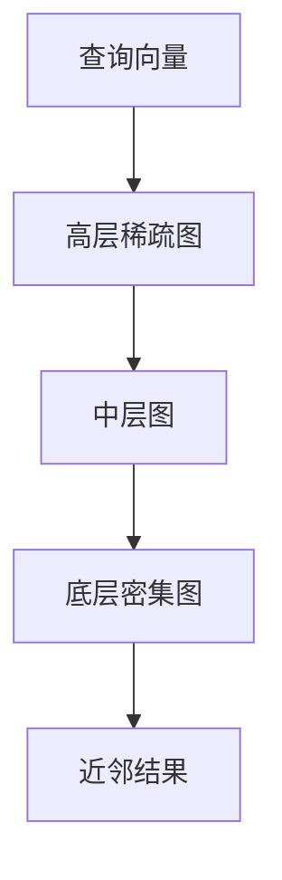

# 向量数据库科普与选型：从 Embedding 到 HNSW

> 向量数据库这些年常被讲得很神秘，好像只要把文档往里一丢，语义检索就会自动变聪明。
> 现实当然没这么省心。它确实是 RAG 里非常重要的一环，但如果不理解它到底存了什么、查了什么、为什么快、又为什么会贵，你在选型、调参和容量规划上很容易一路踩坑。

::: info 这篇文章重点
- 向量到底是什么，为什么可以支持语义检索
- ANN 为何是向量检索系统的核心
- HNSW 为什么流行，它的代价又是什么
- 向量数据库该如何放到 RAG 系统里理解
:::

## 1. 什么是向量

当一段文本被 Embedding 模型处理后，它会被映射成一串高维数值。你可以把它理解成“语义坐标”：

- 内容相近的文本，通常在向量空间里更接近
- 内容差异大的文本，通常更远

这也是向量检索能做语义匹配的基础。

它和传统关键词检索的最大差别是：

- 关键词检索看字面是否匹配
- 向量检索看语义是否相近

## 2. 为什么不能直接暴力全量比对

理论上，用户问题向量生成后，可以和所有文档向量逐个比较相似度，然后选 Top K。

但当数据规模变大，这种全量扫描会迅速失去可用性。于是工程上需要近似最近邻（ANN）方法，在速度和精度之间做平衡。

## 3. ANN：向量检索系统真正的核心

ANN 的目标不是保证数学上绝对最优，而是在可接受时间内找到“足够好的近邻”。

这也是向量数据库区别于“只会存向量”的关键之处：它不只是存储，更重要的是建立高效索引和近似搜索机制。

## 4. HNSW 为什么这么常见

HNSW（Hierarchical Navigable Small World）之所以流行，原因通常有三点：

- 检索速度快
- 召回率表现好
- 在很多通用场景里效果稳定

它的直觉可以理解为：通过多层图结构，把“从远到近逼近目标”的搜索过程组织起来，让系统不必遍历所有节点。

搜索时，系统会先在高层快速靠近目标区域，再逐层下钻到更细粒度的邻域。

## 5. HNSW 的代价：不是没有代价的高性能

HNSW 的常见代价包括：

- 索引内存占用高
- 构建和维护索引需要成本
- 在超大规模数据场景下，资源规划要谨慎

所以它并不是“永远最优解”，而是一个在速度和质量之间很平衡的默认选项。

## 6. 选型时真正该看什么

讨论向量数据库时，别只问“支不支持 HNSW”。更重要的是：

- 数据规模多大
- 查询延迟要求多高
- 是否需要过滤条件
- 是否需要和关键词检索混合
- 是否需要分片、持久化和运维能力

因为对 RAG 来说，向量库不是单独存在的，而是检索链路中的一环。

## 7. 向量检索不是对关键词检索的完全替代

向量检索很擅长找“意思相近”，但对下面这些内容未必天然占优：

- 编号
- 特定术语
- SKU、设备 ID
- 法条编号

所以企业场景里，常见做法不是“只留向量检索”，而是把它和关键词检索结合起来，形成混合检索。

## 8. 在 RAG 里应该怎么理解向量数据库

对 RAG 系统来说，向量数据库的职责主要是：

- 存放向量化后的知识片段
- 提供相似度召回能力
- 配合过滤和排序产生候选集合

它并不负责：

- 文档解析
- 答案生成
- 最终事实校验

把它看成“RAG 的核心组件之一”，会比看成“RAG 的全部答案”更准确。

## 9. 小结

向量数据库之所以重要，不是因为“向量”这个概念神秘，而是因为它让语义检索在工程上可行。真正值得关注的是：

- Embedding 如何表达语义相近
- ANN 如何在效率和精度间取舍
- HNSW 为什么常用、代价是什么
- 向量检索如何与关键词检索共同构成完整 RAG 链路

理解这些之后，再做选型、调参与容量规划，会比只看产品宣传稳得多。

## 参考资料

- [Hierarchical Navigable Small World Graphs](https://arxiv.org/abs/1603.09320)
- [Retrieval-Augmented Generation for Knowledge-Intensive NLP Tasks](https://arxiv.org/abs/2005.11401)
- 延伸阅读：[深入剖析 RAG](./rag-deep-dive)
